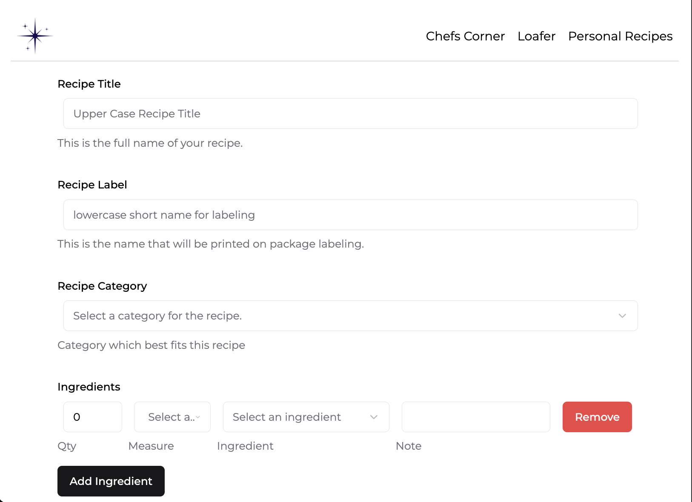
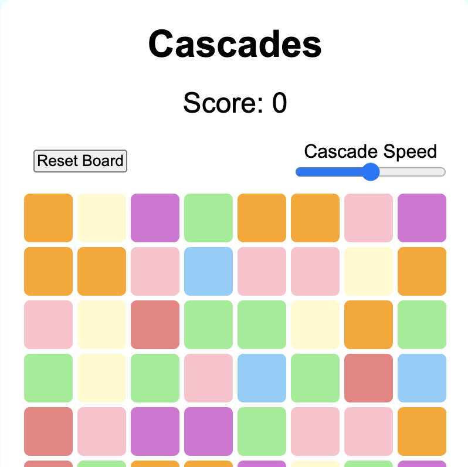
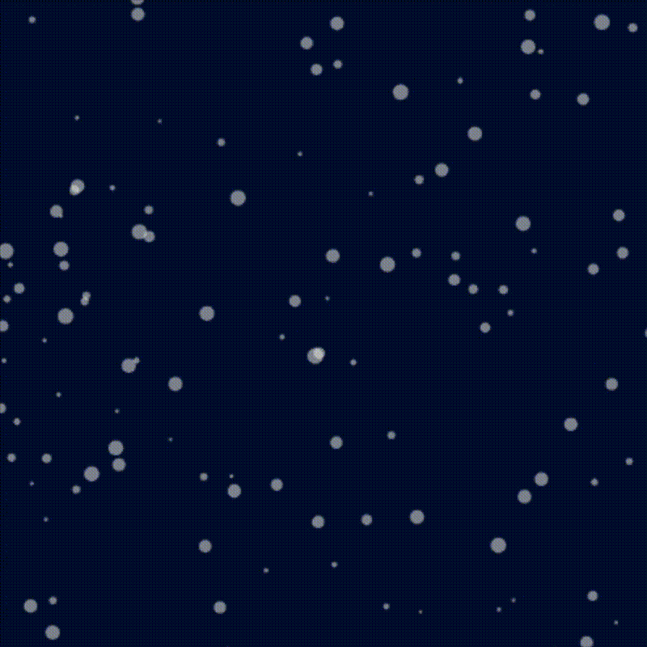

---
# Feel free to add content and custom Front Matter to this file.
# To modify the layout, see https://jekyllrb.com/docs/themes/#overriding-theme-defaults

layout: home
---

<h3 class="post-list-heading">Code Projects</h3>

POC project &nbsp;<b>Recipe Manager</b>, an app to help me manage the ingredients and labeling for my weekend home bakery business. First feature includes database relations of a product which has many recipes, with each recipe having many ingredients, each ingredient with a list of one or many ingredients, and possibly its own recipe. Main goal was to simplify the printing of ingredient labels and allergen warnings for my bakery products.<a href="https://github.com/ck4adventure/recipe_app_nextjs">&nbsp;github only</a>

	

 <a href="https://staging.dg4eq98l6f66l.amplifyapp.com/">Cascades</a> created November 2024 is a tile swapping match-3 game where the tiles cascade down to fill in the empty spaces.

<a href="https://ck4adventure.github.io/snowscene/">Snowscene</a> one of my first projects, is a page with falling "snow" and a few controls such as size and wind speed. 

